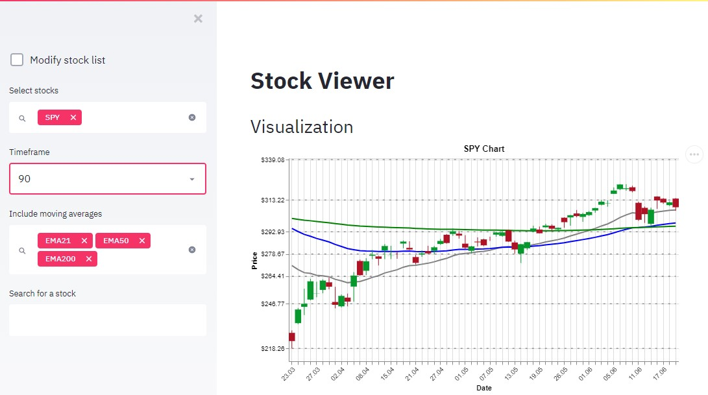

# Stock Charts Viewer

This is a small tool to load historical data of stocks using the free AlphaVantage API. 
The app is programmed with Python and uses the streamlit tool for the web interface. 
Stock data is stored in a diskcache database.

# Functionality

1. You can select stock charts to show from a list that can be modified. 
2. You can also search for new stock symbols by name of the company.
3. The charts can be plotted in different time frames as bar charts.
4. Simple and exponential moving averages can be added to the chart. 
   Fibonacci levels are shown in every chart as a default.
   
# Further Information

License is three-clause BSD. Basically do what you want with the app. 
My main goal was to test the capabilities of Streamlit.
There is a bug when adding a new stock (you have to click twice). I planned to add more analysis features, 
but due to lack of time i am not improving this app in the near future.